# 💳 Credit Card Default Prediction (Credit Scoring)

## 📘 Overview
This project builds a **credit default prediction model** using the classic **“Default of Credit Card Clients”** dataset from UCI. It walks through an end-to-end **credit scoring workflow** — from **EDA and preprocessing**, through **modeling and risk metrics (ROC, PR, KS, PSI, Brier)**, to **explainability with SHAP and partial dependence plots**.

The focus is on mimicking a realistic **credit risk** pipeline:
- Good **discriminative power** (ROC / PR / KS)
- Reasonable **probability calibration** (Brier, calibration curve)
- **Interpretable drivers of default** for model risk management and regulators.

## 🧩 Objectives
- Predict whether a credit card client will **default next month**.
- Handle **class imbalance** using `class_weight = "balanced"`.
- Compare:
  - **Logistic Regression** (interpretable baseline)
  - **Random Forest** (non-linear baseline)
- Evaluate with credit-scoring–friendly metrics:
  - **ROC-AUC, PR-AUC, KS, Brier score, PSI**
- Explain model behavior with:
  - **Permutation importance**
  - **Global SHAP (summary & dependence)**
  - **Local SHAP for TP / FP / FN / TN customers**

## 📊 Dataset
- **Source:** [Default of Credit Card Clients — UCI Machine Learning Repository](https://archive.ics.uci.edu/dataset/350/default+of+credit+card+clients)
- **Raw file:** `data/default_of_credit_card_clients.csv`
- **Size:** 30,000 clients, 25 columns (ID + 23 features + target)
- **Target:** `default` (binary; 1 = default payment next month, 0 = no default)
- **Overall default rate: 22.12%**

### Main Feature Groups
- **Demographics / Contract**
  - `LIMIT_BAL` – credit limit
  - `SEX` (renamed → `gender`), `EDUCATION`, `MARRIAGE`, `AGE`
- **Repayment status (months t-1 … t-6)**
  - `PAY_0`–`PAY_6` (renamed: `PAY_0` → `pay_1` for September, then `pay_2`–`pay_6`)
  - Encodes repayment delay: **−2, −1, 0, 1, 2, …** (from pay in full → increasing delay)
- **Bill statements (`BILL_AMT1`–`BILL_AMT6`)**
- **Past payments (`PAY_AMT1`–`PAY_AMT6`)**

## 🧠 Project Workflow
### 1️⃣ Exploratory Data Analysis & Preprocessing
📄 `notebooks/01_eda_preprocessing.ipynb`

Main steps:
- Loaded the raw dataset and confirmed **no missing values** in any column.
- Renamed columns for readability:
  - `default payment next month` → `default`
  - `PAY_0` → `pay_1` (September status)
  - `SEX` → `gender`
- Cleaned categorical codes:
  - `education`: merged values {0, 5, 6} → `"Other"`
  - `marriage`: recoded 0 → `"Other"` and mapped all to human-readable labels.
- Casted payment status variables (`pay_1`–`pay_6`) and demographics (`gender`, `education`, `marriage`) as categoricals.
- Created **log-transformed features** for skewed monetary variables (clip at 0 + `log1p`):
  - `log_limit_bal`, `log_bill_amt1`–`log_bill_amt6`, `log_pay_amt1`–`log_pay_amt6`.
- Split into **features** and **target**, dropped `id`, and performed a **stratified** 80/20 split:
  - Train: (24,000 × 36), Test: (6,000 × 36), same default rate ≈ 22.1%.
- Saved cleaned dataset → `data/interim/df_preprocessed.csv`.

### 2️⃣ Modeling
📄 `notebooks/02_modeling.ipynb`

**Train / Test Split**
- `X`: all features except `default` and `id`
- `y`: `default`
- Stratified split 80% / 20%. Train default rate: 0.221, test: 0.221.

**Preprocessing Pipeline**
Used `ColumnTransformer` to build a **single sklearn pipeline** for both models:
- **Numeric** (`num_cols`)
  - Standardized with `StandardScaler`.
- **Categorical** (`cat_cols`)
  - One-Hot Encoding (`OneHotEncoder(handle_unknown = "ignore", sparse_output = False)`).
- Remainder columns are dropped.

**Models Compared**
- **Logistic Regression (baseline, interpretable)**
  - `LogisticRegression(max_iter = 1000, class_weight = "balanced", random_state = 42)`
  - Wrapped inside the preprocessing pipeline.
- **Random Forest (non-linear baseline)**
  - `RandomForestClassifier(n_estimators = 400, max_depth = None, min_samples_leaf = 2, class_weight = "balanced", n_jobs = -1, random_state = 42)`
  - Also wrapped in the same `pre` pipeline.

#### 🔍 Results Summary (Threshold = 0.50)
| **Model** | **ROC-AUC**| **PR-AUC** | **F1 (default = 1)** | **KS** | **Brier** |
| ------------- | ------------- | ------------- | ------------- | ------------- | ------------- |
| Logistic Regression | **0.771** | 0.532 | 0.524 | **0.419** | 0.184 |
| Random Forest | 0.767 | **0.545** | 0.501 | 0.417 | **0.141** |

Notes:
- **Logistic Regression** has slightly higher **ROC-AUC** and **KS**.
- **Random Forest** has better **PR-AUC** and noticeably lower **Brier score** (better calibration of probabilities).

🧪 **Stability – PSI**
To get a flavour of **population stability**, the RF scores on train and test were compared via **PSI**:
- **PSI (RF train → test): 0.461**
This indicates a **non-trivial shift** between training and test score distributions — in a real credit risk setting this would trigger further investigation or recalibration.

🎯 **Chosen “Production” Model**
- **Chosen model: Random Forest** (slightly better PR-AUC + better Brier score; aligns with use of calibrated PDs in credit risk).
- Saved artifacts:
  - `models/artifacts/credit_model.joblib`
  - `models/artifacts/metadata.json` (stores feature lists, chosen threshold, metrics, etc.).

### 3️⃣ Model Explainability
📄 `notebooks/03_explainability.ipynb`

This notebook focuses on understanding **how** the Random Forest makes decisions.

**Performance at Operating Threshold (t = 0.36)**
Using the saved threshold from modeling:
- **Threshold:** 0.36
- **Precision (default = 1):** 0.514
- **Recall (default = 1):** 0.564
- **F1 (default = 1):** 0.538
- **ROC-AUC:** 0.767
- **PR-AUC:** 0.545
- **Brier score:** 0.141

**Confusion matrix (test set, t = 0.36):**
```lua
[[3965, 708],
  [ 579, 748]]
```
This tuning improves the F1 of the default class compared to the plain 0.5 threshold, at the cost of some extra false positives — a common trade-off in credit scoring.

#### 🔑 Global Feature Importance
**1. Permutation Importance (AUC Loss)**

Top features by permutation importance (Random Forest, test set):
1. `pay_1_2` – September status = 2 (two-month delay)
2. `pay_1_0` – September status = 0 (on-time repayment)
3. `pay_2_2` – August status = 2
4. `log_limit_bal`
5. `pay_3_2` – July status = 2
6. `log_pay_amt1`, `pay_amt1` (most recent payment size)
7. `pay_4_2`, `pay_5_2` (earlier months with delay)
8. `log_pay_amt2`, `log_pay_amt3`, `pay_amt2`, `pay_amt3`
9. `log_bill_amt1`, `bill_amt1`, `bill_amt2`

→ The model is heavily driven by **recent repayment behavior**, **credit limit**, and **recent payment/bill amounts** — exactly what we’d expect in a credit scoring setting.

**2. SHAP Global Importance (Mean |SHAP|)**
Using SHAP (TreeExplainer on the Random Forest, 500-row test subsample), we computed mean absolute SHAP values and saved them as:
- `models/artifacts/feature_importance_shap.csv`

Top 5 global drivers:
1. `pay_1_2`
2. `pay_1_0`
3. `pay_2_2`
4. `limit_bal`
5. `log_limit_bal`

SHAP confirms what permutation importance suggests:
- Being **two months late** in the most recent period (`pay_1_2`) massively pushes the probability of default up.
- Larger **credit limits** and their log transform tend to **lower** predicted default risk (ceteris paribus).

#### 📊 Partial Dependence (PDP)
To inspect marginal effects in the **original scale**, Partial Dependence Plots were computed for:
- `limit_bal`
- `age`
- `bill_amt1`
Saved as:
- images/pdp_top_raw_features.png
These plots show, for example, how **higher credit limits** and **higher first bill amounts** relate to changes in average predicted default probability.

#### 🐝 SHAP Visualizations
Global SHAP plots (Random Forest + preprocessed features):
- **Global Feature Importance (bar):**
  - `images/shap_summary_bar.png`
- **Beeswarm (direction + magnitude):**
  - `images/shap_summary_beeswarm.png`

Dependence plots for the top SHAP features (saved as separate files):
- `images/shap_dependence_pay_1_2.png`
- `images/shap_dependence_pay_1_0.png`
- `images/shap_dependence_pay_2_2.png`
- `images/shap_dependence_limit_bal.png`
- `images/shap_dependence_log_limit_bal.png`

#### 👤 Local Explanations (TP / FP / FN / TN)
To make explanations relatable, the notebook:
1. Builds a small dataframe with `y`, `proba`, `pred` at `t = 0.36`.
2. Samples one example for each quadrant:
  - **TN** (correct non-default)
  - **FP** (false alarm)
  - **FN** (missed default)
  - **TP** (correct default)
3. Computes SHAP only for these selected customers and plots **waterfall explanations**.

Saved local plots:
- `images/local/shap_local_TN.png`
- `images/local/shap_local_FP.png`
- `images/local/shap_local_FN.png`
- `images/local/shap_local_TP.png`

Additionally, there is a helper function to extract **top positive and negative SHAP drivers** in tabular form for any of these customers:
- `explain_local_instance(global_row_idx, top_n = 5)`

This is the kind of textual explanation that can later be surfaced in a credit decisioning UI.

## 🧩 Visualizations
### Model Evaluation
| **Metric** | **Plot**|
| ------------- | ------------- | 
| Confusion Matrix | 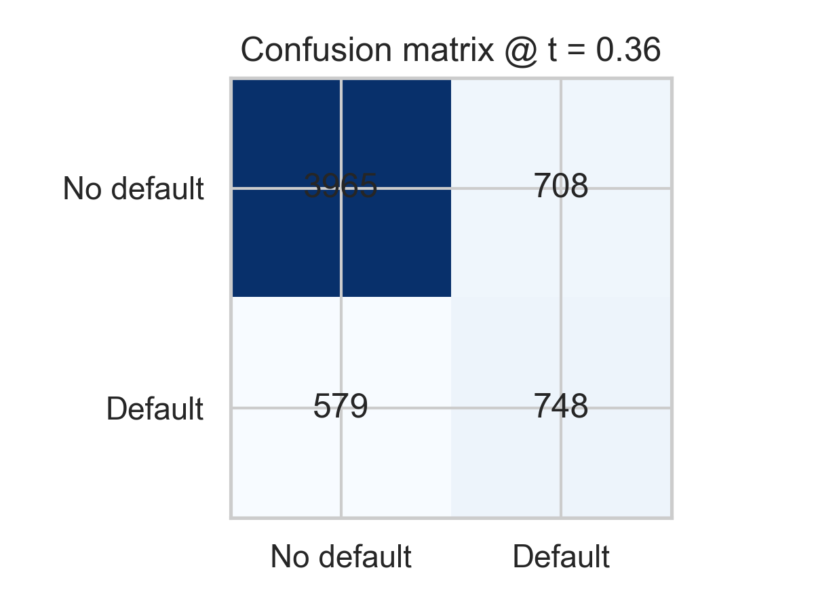 |
| Calibration Curve | 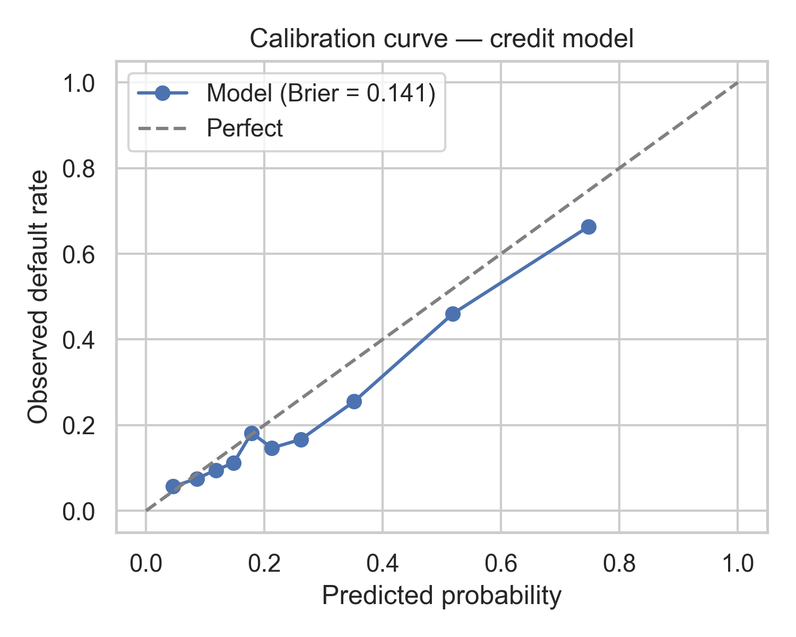 |

### Explainability
| **Type** | **Plot**|
| ------------- | ------------- | 
| Global — SHAP Bar Importance | 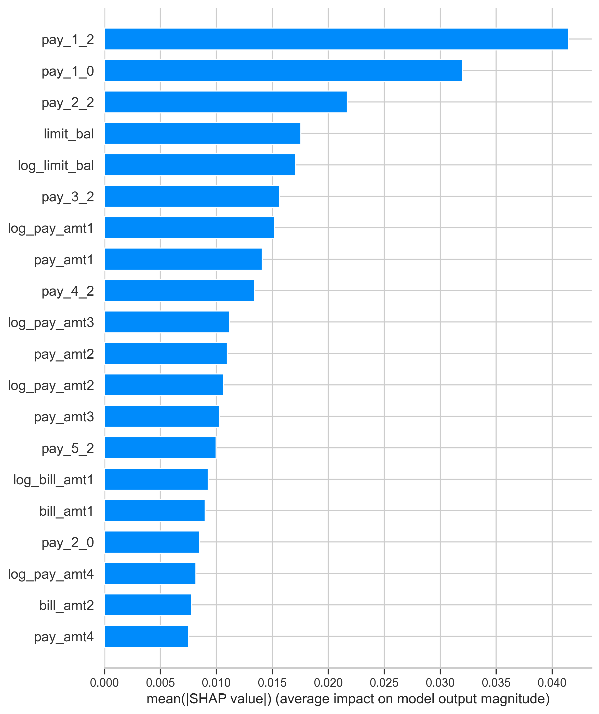 |
| Global — SHAP Beeswarm | 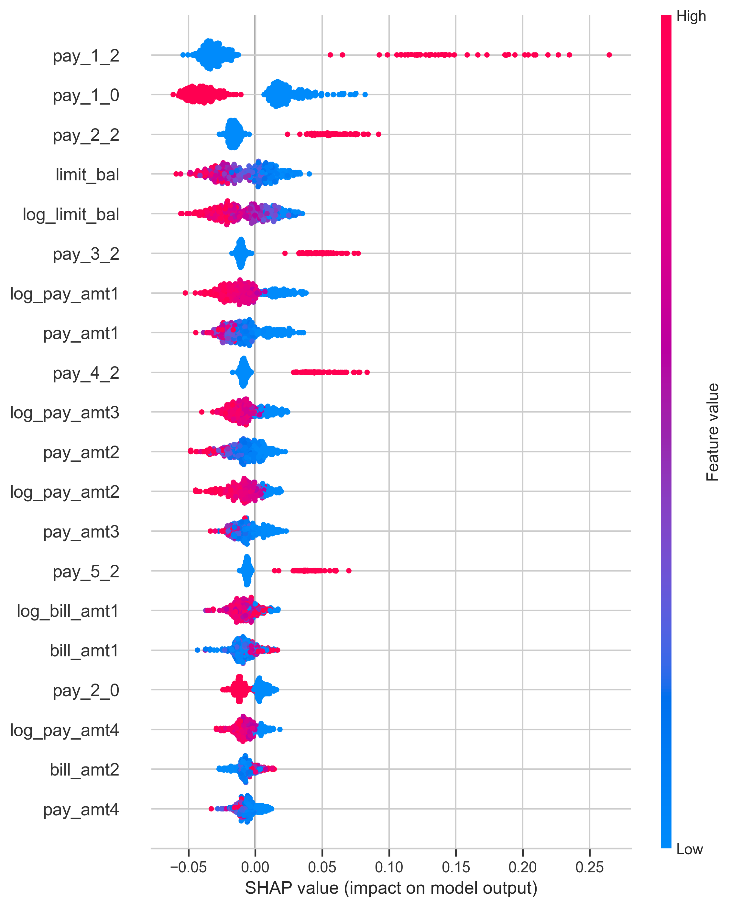 |
| PDP — Key Raw Features | 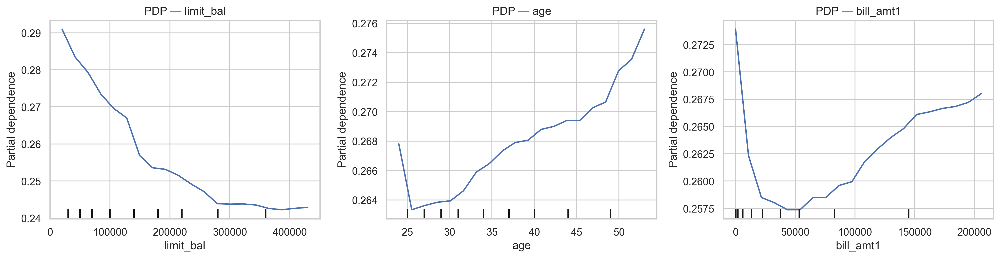 |
| SHAP Dependence (top features) | 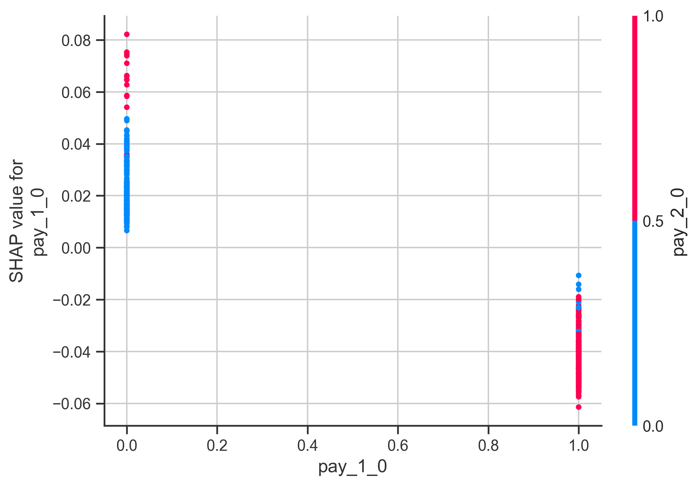 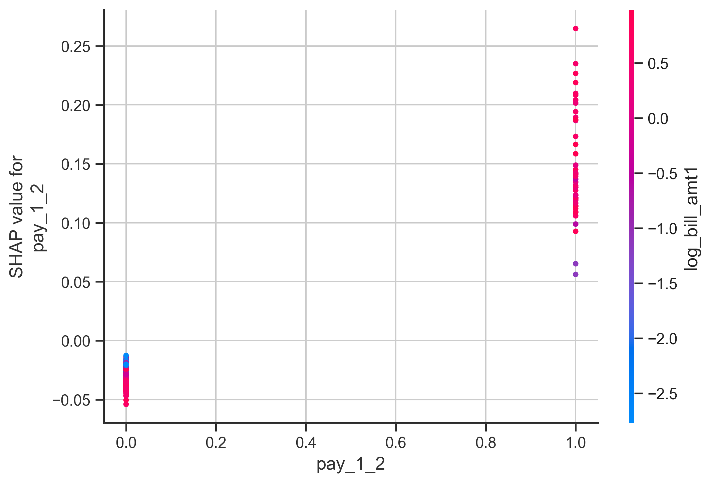 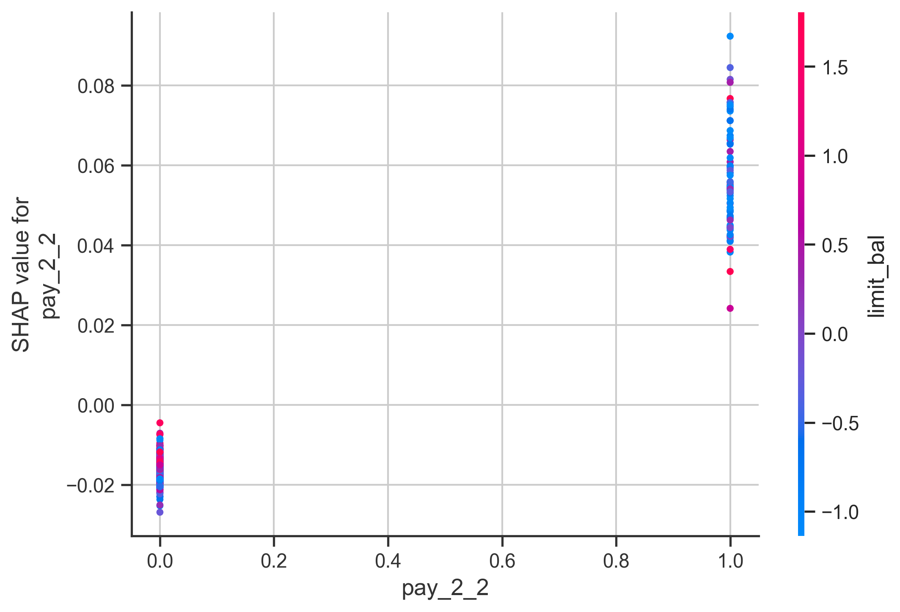 |
| Local SHAP — TN / FP / FN / TP | 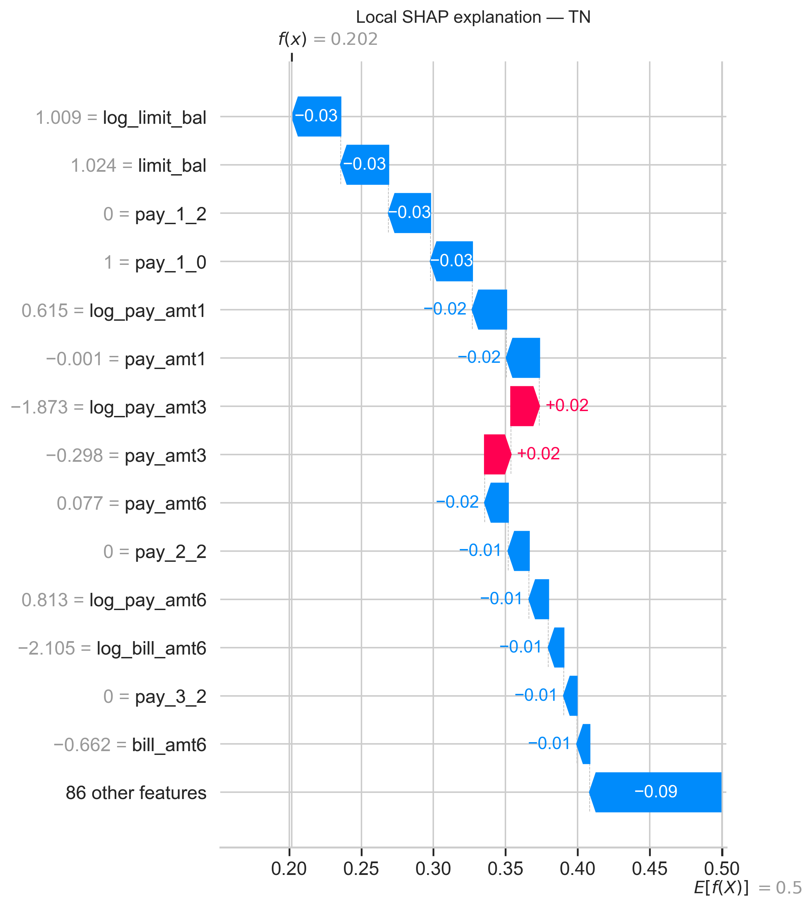 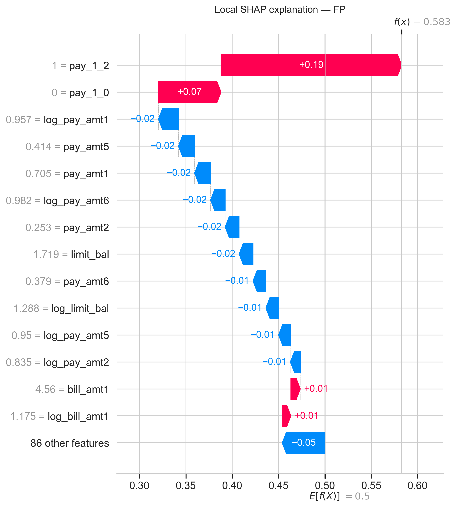 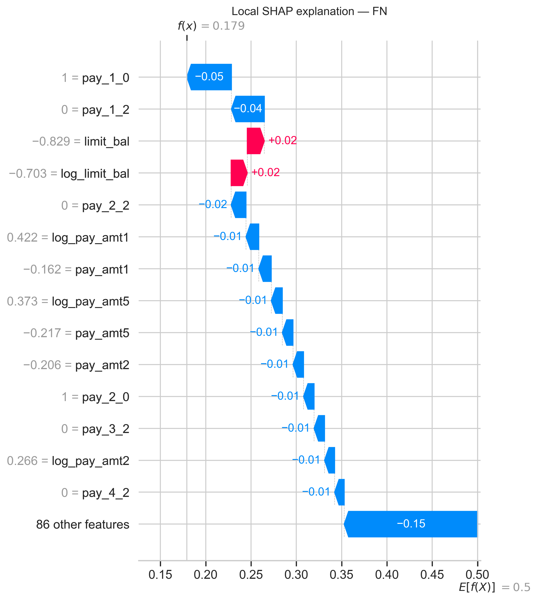 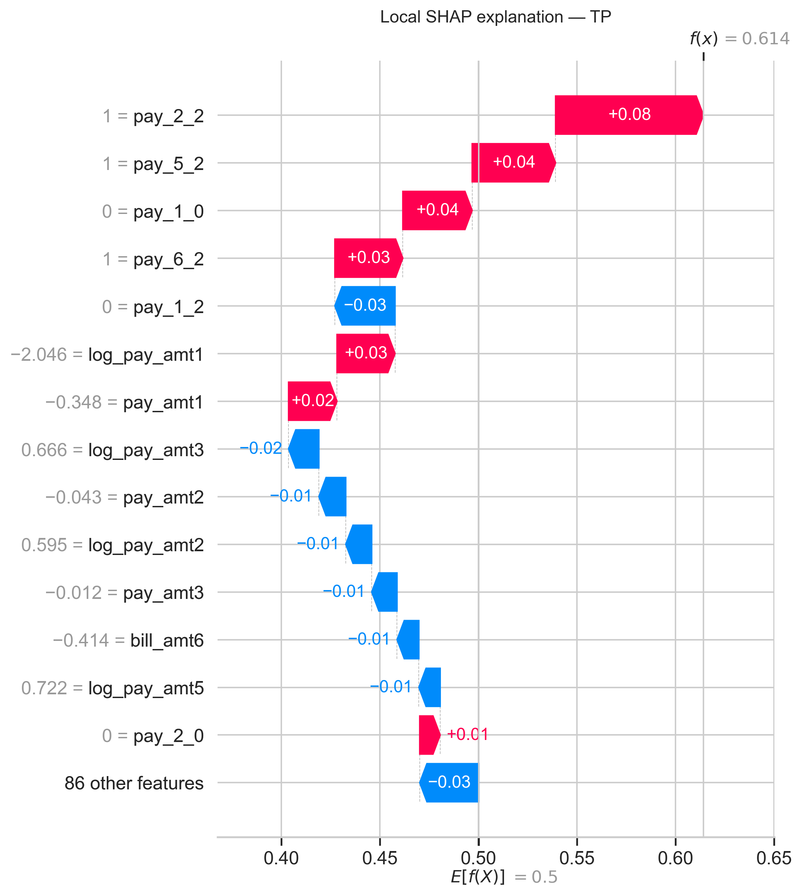 |

## 🧮 Repository Structure
```plaintext
Credit_Scoring/
├── data/
│   ├── default_of_credit_card_clients.csv
│   └── interim/
│       └── df_preprocessed.csv
├── images/
│   ├── confusion_matrix.png
│   ├── calibration_curve.png
│   ├── shap_summary_bar.png
│   ├── shap_summary_beeswarm.png
│   ├── pdp_top_raw_features.png
│   ├── shap_dependence_*.png
│   └── local/
│       └── shap_local_*.png
├── models/
│   └── artifacts/
│       ├── credit_model.joblib
│       ├── metadata.json
│       └── feature_importance_shap.csv
├── notebooks/
│   ├── eda_preprocessing.ipynb
│   ├── modeling.ipynb
│   └── explainability.ipynb
├── requirements.txt
├── .gitignore
└── README.md
```

## ⚙️ Setup & Reproducibility
### 1️⃣ Clone repository
```bash
git clone https://github.com/aituar17/Credit_Scoring.git
cd Credit_Scoring
```
### 2️⃣ Create environment
```bash
python -m venv .venv
# Windows
.venv\Scripts\activate
# macOS / Linux
# source .venv/bin/activate

pip install -r requirements.txt
```
### 3️⃣ Run notebooks (in order)
```bash
notebooks/01_eda_preprocessing.ipynb
notebooks/02_modeling.ipynb
notebooks/03_explainability.ipynb
```

## 💬 Insights & Business Impact
- **Recent repayment behavior drives risk:**
  Severe delays in the **most recent months** (`pay_1`, `pay_2`, `pay_3`) are the strongest predictors of default.
- **Credit limit matters:**
  Higher `limit_bal` (and `log_limit_bal`) is generally associated with **lower default probabilities**, potentially capturing both income/wealth and lending policies.
- **Payment and bill amounts are secondary but important:**
  Recent paid amounts and bill statements refine the risk signal, especially when combined with repayment status.
- **Explainability enables governance:**
  SHAP + permutation importance + partial dependence plots provide a **transparent story**:
  - What drives PDs globally
  - Why this particular customer is classified as risky (local waterfalls + textual explanations)
    This is exactly the type of evidence **model validation** and **regulators** tend to request.

## 📈 Next Steps
- Add **probability calibration** (e.g., Platt scaling / isotonic regression) on top of Random Forest.
- Implement **scorecards** or monotonic models (e.g., Logistic Regression with WOE binning) for even higher interpretability.
- Operationalize the model as a **REST API** (FastAPI / Flask) for real-time scoring.
- Monitor **PSI** and performance over time to detect population drift and trigger retraining.
- Extend the framework to other credit products (e.g., installment loans, SME loans) or to **behavioral scoring**.
